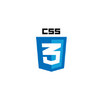

# Modulo 3 - Evaluación final -Iratxetos 

👋 ¡Hola!

Esta es mi **evaluación final** del módulo 3 para el Bootcamp de Adalab 👩

Hecho con las tecnologías:

      

📢 Estoy aprendiendo, estaré encantada de escuchar comentarios de mejora.

**Gracias** por tu visita 💁‍♀️

Conecta conmigo en el siguiente ícono:
[📩](https://www.linkedin.com/in/iratxe-martin-perez/)

**Iratxe.**